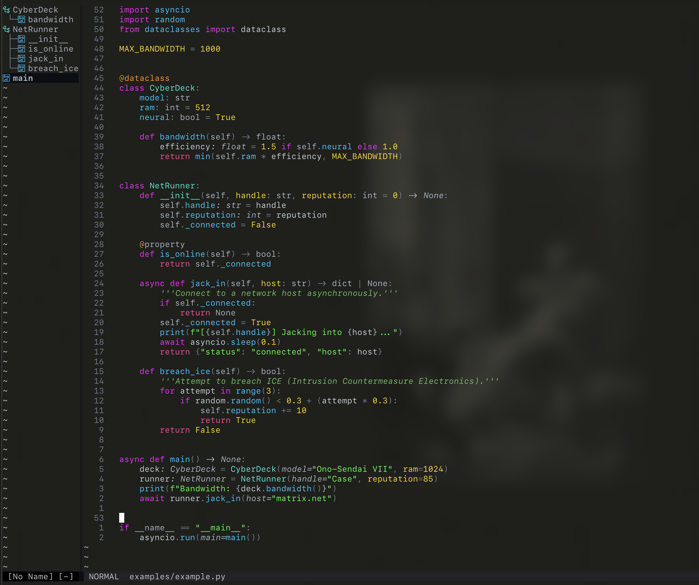
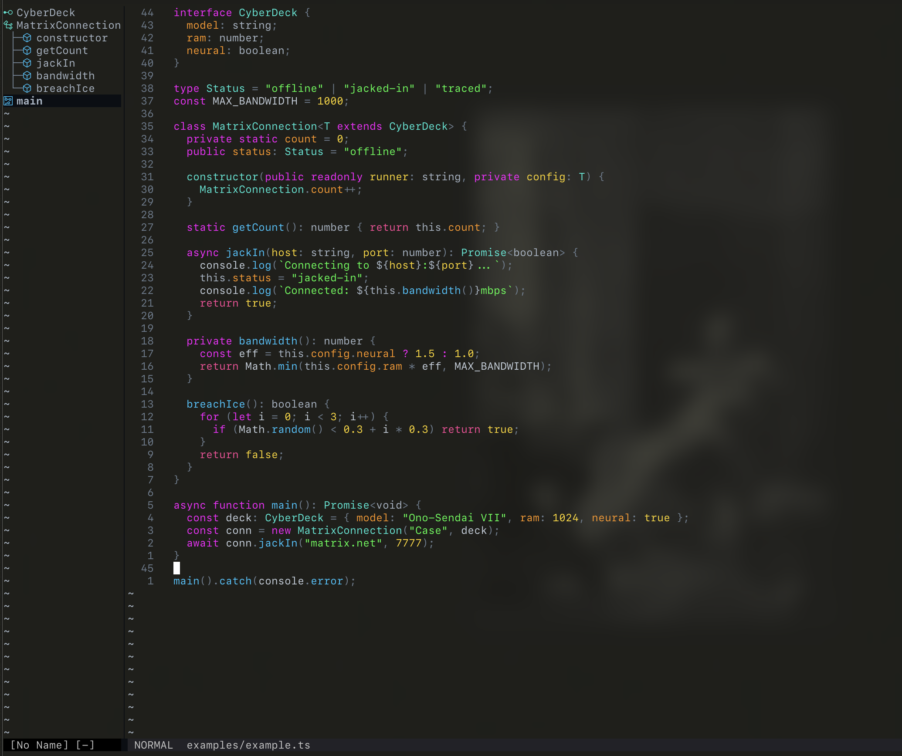
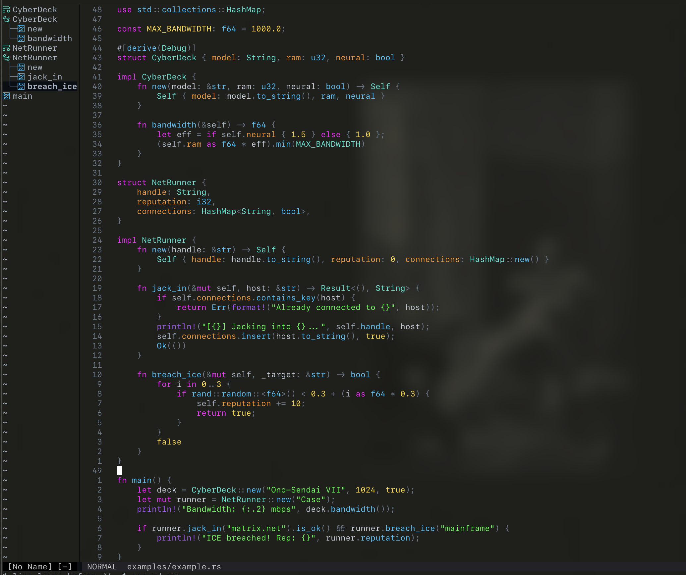

# spacecowboy.nvim

A cyberpunk Neovim colorscheme for console cowboys jacking into the matrix. Inspired by the electric data streams of Neuromancer, the neon-soaked streets of Blade Runner, and the jazz-infused cosmos of Cowboy Bebop.

## Screenshots

<details>
<summary>Python</summary>

</details>

<details>
<summary>TypeScript</summary>

</details>

<details>
<summary>Rust</summary>

</details>

## Features

- **Cyberspace Aesthetic**: Electric neon colors against dark terminal backgrounds - ice blues, matrix greens, hot pinks, and gold
- **Semantic Highlighting**: Full support for TreeSitter and LSP semantic tokens
- **Language-Optimized**: Specialized highlighting for Python, TypeScript, JavaScript, JSX/TSX, Rust, and Lua
- **Plugin Integration**: Native support for popular plugins (LSP, diagnostics, flash.nvim, snacks.nvim, etc.)
- **Terminal Transparency**: Designed to work beautifully with transparent backgrounds

## 📦 Installation

### [lazy.nvim](https://github.com/folke/lazy.nvim)

```lua
{
  "andrewbgrant/spacecowboy.nvim",
  lazy = false,
  priority = 1000,
  config = function()
    require("spacecowboy").setup({})
    vim.cmd.colorscheme("spacecowboy")
  end,
}
```

## 🎨 Color Palette

The spacecowboy palette draws inspiration from cyberspace and the digital matrix:

### Base Colors

- **Sand** `#a8b5c4` - Primary text (chrome)
- **White** `#c5d0dc` - Variables (bright chrome)
- **Grey** `#6b7b8c` - Secondary elements
- **Black** `#0a0e14` - Deep void backgrounds

### Cyberspace Colors

- **Ice Blue** `#00c5ff` - Functions and methods (cold utilities)
- **Matrix Green** `#00ff41` - Strings (raw data streams)
- **Electric Cyan** `#00d4d4` - Imports (matrix architecture)
- **Bright Teal** `#00e8d4` - Classes (data structures)
- **Hot Pink** `#ff00ff` - Keywords (fundamental constructs)
- **Gold** `#ffd700` - Constants (valuable data)
- **Neon Orange** `#ff9500` - Properties
- **Deep Purple** `#a855f7` - Decorators (ICE)
- **Bright Red** `#ff0055` - Errors (intrusion/flatline)

## 🎭 Variants

spacecowboy comes with three intensity variants to match your preference:

### Bright (Default)
Full neon cyberspace - maximum vibrancy for that authentic matrix feel
```lua
require("spacecowboy").setup({
  variant = "bright", -- Default, can be omitted
})
```

### Neutral
Balanced intensity - still vibrant but easier on the eyes for long coding sessions
```lua
require("spacecowboy").setup({
  variant = "neutral", -- 20% reduced intensity
})
```

### Muted
Subdued and understated - retains the color scheme but with lower saturation
```lua
require("spacecowboy").setup({
  variant = "muted", -- 40% reduced intensity
})
```

## ⚙️ Configuration

```lua
require("spacecowboy").setup({
  variant = "bright", -- "bright" (default) | "neutral" | "muted"

  -- Customize colors
  on_colors = function(colors)
    -- Modify the color palette
    -- colors.sage_green = "#custom_color"
  end,

  -- Customize highlights
  on_highlights = function(highlights, colors)
    -- Modify highlight groups
    -- highlights.Comment = { fg = colors.grey, italic = false }
  end,
})
```

## 🔧 Usage

After installation, activate the colorscheme:

```lua
vim.cmd.colorscheme("spacecowboy")
```

Or in Vimscript:

```vim
colorscheme spacecowboy
```

## 🤝 Contributing

Contributions are welcome! Feel free to:

- Report bugs
- Suggest new features
- Submit pull requests
- Share screenshots of your setup

## 🙏 Acknowledgments

- Theme structure and setup based on [folke/tokyonight.nvim](https://github.com/folke/tokyonight.nvim). Thanks to [@folke](https://github.com/folke) for the excellent template.
- Color palette inspired by [rose-pine/neovim](https://github.com/rose-pine/neovim) and [ayu-theme/ayu-vim](https://github.com/ayu-theme/ayu-vim) as well

## 📝 License

Apache 2.0

## 💫 Inspiration

> "I've seen things you people wouldn't believe..."

This theme is a love letter to the works that defined the cyberpunk genre and continue to inspire developers worldwide.

---

**See you space cowboy...**
